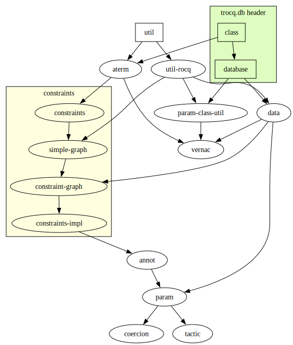

# Code Base

This page is a list of useful documentation regarding how is constructed the code behind Trocq.
The intended audience is people who will help develop Trocq, or those who want to understand its code.

## Rocq

Trocq was meant to be built with the HoTT variant of Rocq. Therefore this project has two version,
the `std` version with standard Rocq header, and the `hott` version with HoTT headers.
One can build either version by doing `make std` or `make hott`.

To achieve this, Rocq files are separated in three folders:
- `std/` contains files exclusive to standard version
- `hott/` contains files exclusive to hott version
- `generic/` contains files common to both version

Files in `std/` and in `hott/` should only differ on their implementations, in order to keep the same interface for users
of trocq-std or for those of trocq-hott.

### Rocq files
Here is a quick summary of the goals of each Rocq file :
- `Stdlib.v`: Mappings from HoTT to the closest corresponding lemma matching in standard Rocq.
- `Database.v`: Definition of the trocq database, where relations will further be added.
- `Hierarchy.v`: Creates Rocq objects for trocq parametricity
- `Param_lemmas.v` and `Common.v`: Some helper lemmas about trocq parametricity
- `Param_Type.v`, `Param_Prop.v`, `Param_arrow.v`, and `Param_forall.v`: Defines the parametricity translation terms for Type, Prop, ->, and forall respectively.
  Those files are needed for generic Trocq translations, and 
- `Param.v`: Defines the `trocq` tactic
- `Vernac.v`: Defines the `Trocq` vernacular
- `Param_xxx.v`: Defines the parametricity translation for some common objects.
- `Trocq.v`: Entrypoint of the library, exports everything that should be available to the end user.

## Elpi

[Elpi](https://github.com/LPCIC/elpi/tree/master) is a logic programming language which is extensively used in Trocq.
Using a [Rocq-Elpi API](github.com/LPCIC/coq-elpi), we are able to manipulate Rocq terms and apply our inferences rules to it.
All elpi code from this project is in `elpi/` subfolder.

### Guidelines
When contributing to elpi code, you have to follow the following rules:
- Never have a term of type term `pglobal G _` or `global G` if G is an uvar as Rocq is unable to print them
- Never have a term of type param-class `pc M N` if M or N is an uvar.
  It allows much shorter code where we only have to check U = uvar, rather than
  U = uvar | U = pc uvar _ | U = pc _ uvar | U = pc uvar uvar.
- Predicates `sub-type`,`eq`,`classes` should only be called on aterms that are types, i.e. aterms whose forgotten term has type some sort.
  This allows to remove edge cases that are not well defined (for exemple, such a term cannot be λx:_,_).
  There is still some code used internally by those functions (i.e. recursive calls), but this should be removed.
- Logging prints should start with a tag '[f]' where f is the calling predicate.
- No call to `coq.error`, one should always use `trocq.error` which is defined in `util-rocq.elpi`.
- An elpi file should accumulate all of its dependencies using `accumulate` predicate.
  If you add a new file, don't forget to add it to the graph below (`elpi-dependencies.dot` file) and
  to regenerate the `elpi-dependencies.svg` file with command `dot -Tsvg docs/elpi-dependencies.dot > docs/elpi-dependencies.svg`.

### Dependency graph

Below is a dependency graph of all elpi files.

A full arrow A ---> B means "A is a dependency of B" or "B depends on A" and therefore, file A accumulates file B.

A square box means that the file should be available at syntherp phase (less access to coq-elpi's API)

`constraints` cluster contains files in the constraints subfolder.
Technically, only `constraints.elpi` is needed for typing, but the other files contain executive content of the constraints graph.

## Website

This website is generated by Jekyll using GitHub's "Pages" service.

If you want to test your modifications locally, you can move to the folder `docs/`, and use the command,
`jekyll serve`, and go to http://127.0.0.1:4000 on your browser.
